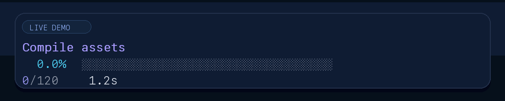
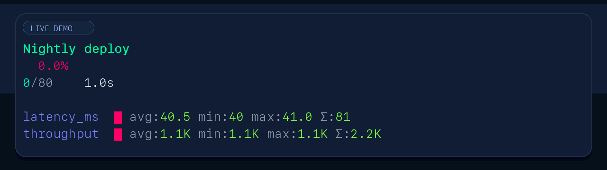

# PROGRESS🦫BAR🦫NONE

Animated progress bars for Ruby CLI applications with 15+ color palettes, 20+ bar styles, real-time metrics, sparkline graphs, Gantt charts, and terminal graphics support.

Brand name: `PROGRESS🦫BAR🦫NONE`. Ruby API aliases: `Cockpit3000`, `PROGRESSBARNONE`, `ProgressBarNone` -- all equivalent.

## Installation

Add to your Gemfile:

~~~ruby
gem "progress_bar_none_overload_3000"
~~~

Or install directly:

~~~bash
gem install progress_bar_none_overload_3000
~~~

## Features

- **Color gradients** -- 15+ palettes with true-color RGB interpolation (crystal, fire, ocean, neon, synthwave, vaporwave, acid, matrix, and more)
- **Bar styles** -- 20+ styles including crystal, blocks, dots, fire, nyan, matrix, glitch, electric, cyberpunk
- **Spinners** -- 27 spinner animations (braille, moon, clock, arrows, rocket, etc.)
- **Real-time metrics** -- Automatic avg/min/max/cumulative tracking with sparkline graphs
- **Gantt charts** -- Task timeline rendering with SVG export and Tufte-inspired defaults
- **Multi-bar** -- Nested progress bars with automatic palette/style cycling
- **Terminal graphics** -- Kitty and iTerm2 inline image protocol support
- **Decorative frames** -- ASCII borders, banners, and title frames
- **Simple API** -- `.with_progress` on any Enumerable
- **Zero dependencies** -- Pure Ruby

## Quick start

~~~ruby
require "cockpit3000"

(1..100).with_progress.each do |i|
  sleep(0.01)
end
~~~

## Usage

### Basic progress bar

~~~ruby
# Simple progress
items.with_progress.each { |item| process(item) }

# With title
items.with_progress(title: "Processing").each { |item| process(item) }

# Custom style and palette
items.with_progress(
  title: "Loading",
  style: :blocks,
  palette: :fire,
  width: 50
).each { |item| load(item) }
~~~

### Tracking custom metrics

Return a hash from your block to automatically track metrics:

~~~ruby
files.with_progress(title: "Analyzing Files").each do |file|
  content = File.read(file)

  # Return metrics -- they are tracked and displayed
  {
    size_kb: content.bytesize / 1024.0,
    lines: content.lines.count,
    words: content.split.count
  }
end
~~~

This displays real-time sparkline graphs for each metric showing:

- **avg** -- Running average
- **min** -- Minimum value seen
- **max** -- Maximum value seen
- **sum** -- Cumulative sum

### Direct API

For more control, use the `Bar` class directly:

~~~ruby
bar = ProgressBarNone::Bar.new(
  total: items.count,
  title: "Processing",
  palette: :ocean
)

bar.start

items.each do |item|
  result = process(item)
  bar.increment(metrics: { duration: result.time, size: result.bytes })
end

bar.finish
~~~

### Multi-bar (nested progress)

~~~ruby
multi = ProgressBarNone::MultiBar.new(title: "Build pipeline")

phases = [
  { name: "Compile", units: 10, palette: :forest, style: :blocks },
  { name: "Link", units: 6, palette: :sunset, style: :crystal },
  { name: "Package", units: 4, palette: :ocean, style: :dots }
]

phases.each do |phase|
  (1..phase[:units]).with_progress(
    title: phase[:name],
    palette: phase[:palette],
    style: phase[:style]
  ).each { |_i| sleep(0.05) }
end
~~~

### Terminal presets

~~~ruby
# Light terminal (higher contrast)
(1..30).with_progress(
  title: "Day shift",
  palette: :ocean,
  style: :blocks,
  spinner: :clock
).each { sleep(0.03) }

# Dark terminal (neon aesthetics)
(1..30).with_progress(
  title: "Night shift",
  palette: :matrix,
  style: :cyberpunk,
  rainbow_mode: true,
  spinner: :sparkle,
  glow: true
).each { sleep(0.03) }
~~~

### ProgressBar compatibility

Drop-in replacement for the `ruby-progressbar` API:

~~~ruby
bar = ProgressBar.create(total: 100, title: "Working")
100.times { bar.increment }
bar.finish
~~~

## Styles

| Style | Characters | Best for |
| ------- | --------- | -------- |
| `:crystal` | `⟨████░░░░⟩` | Modern terminals |
| `:blocks` | `[████░░░░]` | Standard look |
| `:dots` | `(●●●●○○○○)` | Minimal |
| `:arrows` | `«▶▶▶▶▹▹▹▹»` | Directional |
| `:ascii` | `[####----]` | Maximum compatibility |

## Color palettes

| Palette | Colors | Mood |
| --------- | ------ | ------ |
| `:crystal` | Cyan to Purple to Pink | Elegant, modern |
| `:fire` | Orange to Yellow | Warm, energetic |
| `:ocean` | Deep blue to Turquoise | Calm, professional |
| `:forest` | Deep green to Light green | Natural, growth |
| `:sunset` | Purple to Orange to Yellow | Vibrant, dramatic |
| `:rainbow` | Full spectrum | Colorful |
| `:mono` | Grayscale | Subtle, accessible |

## Display elements

~~~text
Processing Items
 45.0% ⟨██████████████████░░░░░░░░░░░░░░░░░░░░⟩
⠹ 45/100  4.5/s  10.0s  ETA 12.2s

latency_ms ▁▂▃▄▅▆▇█▆▅▄▃▂▁ avg:45.2 min:12 max:89 sum:2034
throughput ▇▆▅▄▃▂▁▂▃▄▅▆▇█ avg:1.2K min:800 max:2.1K sum:54K
~~~

Elements shown: progress percentage, animated progress bar, spinner, items completed/total, processing rate, elapsed time, ETA, and custom metrics with sparkline graphs.

## Requirements

- Ruby 4.0+
- Terminal with Unicode support (for best results)
- True color support recommended (falls back gracefully)

## Demo

Run the interactive demo:

~~~bash
ruby bin/demo
~~~

Regenerate the animated README assets:

~~~bash
ruby bin/render_demo_assets
~~~

### Animated examples

## Benchmarks

Run locally:

~~~bash
bundle exec rake benchmark                               # human-readable table
BENCH_JSON=1 bundle exec rake benchmark                  # JSON for CI ingestion
ruby test/benchmark🦫_test.rb --compare prior.json       # compare against a prior run
~~~

CI runs lint, tests, and a benchmark job on every push and pull request. The separate `Benchmark Matrix` workflow runs the full OS/Ruby/shell matrix on demand and on a weekly schedule, then uploads a collated comparison chart as an artifact.

### Local baseline (CRuby 4.0.2 / macOS / zsh)

| Benchmark | Wall (s) | CPU (s) | Mem delta (KB) | Objects |
| --- | ---: | ---: | ---: | ---: |
| `ansi_strip_10k_calls` | 0.4458 | 0.4420 | 21,392 | 30,023 |
| `sparkline_1000_values` | 0.0644 | 0.0638 | 2,496 | 150,042 |
| `memory_stress_100_bars` | 0.0150 | 0.0149 | 1,408 | 64,524 |
| `ansi_color_18_palettes_x_1000` | 0.0111 | 0.0111 | 672 | 61,001 |
| `frames_all_styles` | 0.0054 | 0.0053 | 0 | 44,832 |
| `basic_progress_5000` | 0.0037 | 0.0037 | 32 | 15,362 |
| `direct_bar_api_5000` | 0.0035 | 0.0035 | 0 | 15,372 |
| `all_28_spinners` | 0.0030 | 0.0030 | 336 | 13,714 |
| `all_21_styles` | 0.0022 | 0.0022 | 32 | 10,405 |
| `all_18_palettes` | 0.0021 | 0.0021 | 576 | 8,335 |
| **Total (20 benchmarks)** | **0.564** | **0.559** | **peak: 49 MB** | **433,728** |

## License

This project is governed by multiple terms and policies:

- [Free Art License 1.1](https://artlibre.org/licence/lal/en/)
- [Protein Database Terms of Service](https://www.rcsb.org/pages/policies)
- [Anna's Archive Privacy Policy](https://annas-archive.org/privacy)

SPDX: CC0-1.0. See `LICENSE` for details.

## Author

Karl Amort -- [Bluesky](https://bsky.app/profile/amort.berlin) / [X](https://x.com/amortberlin)
